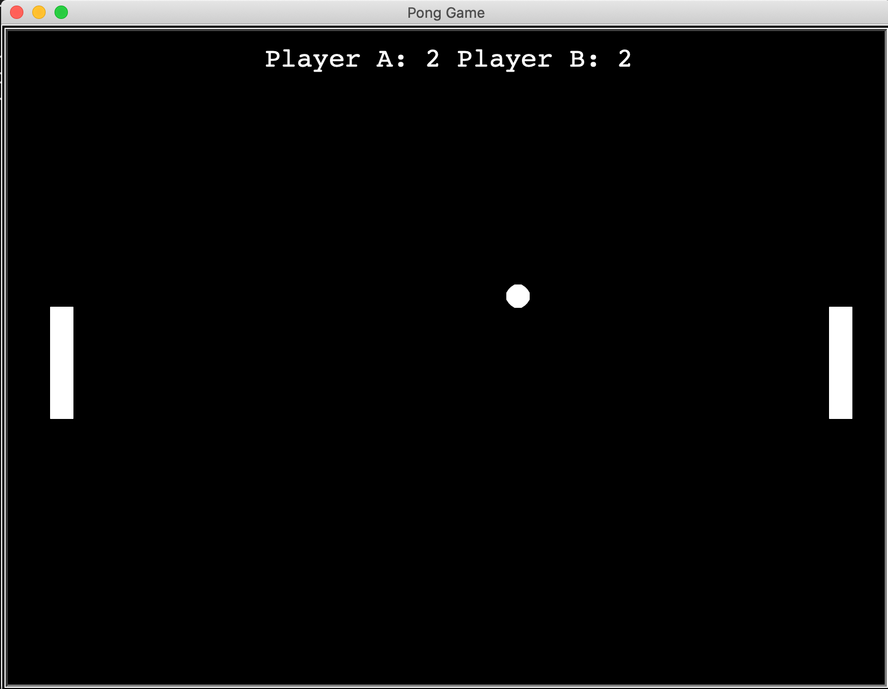

# pong game

A simple pong game implemented in Python. 

## How to play

1. Run the game in your terminal using command `python pong.py`.

2. For the player 1, using W,S to move up,down.

3. For the player 2, using ⬆,⬇ to move up,down.

4. Good Luck!